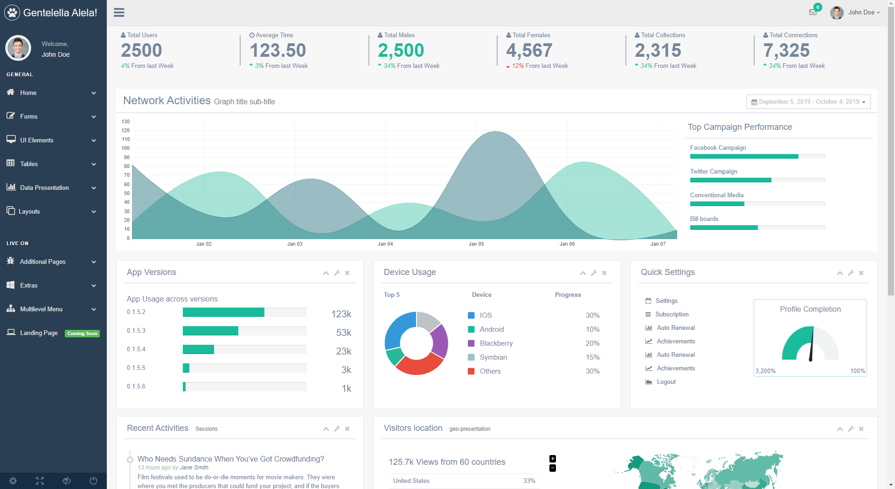
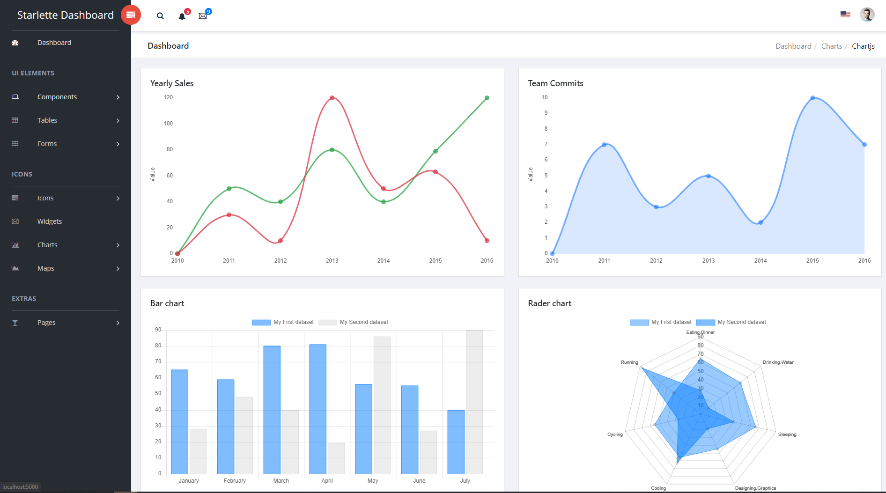
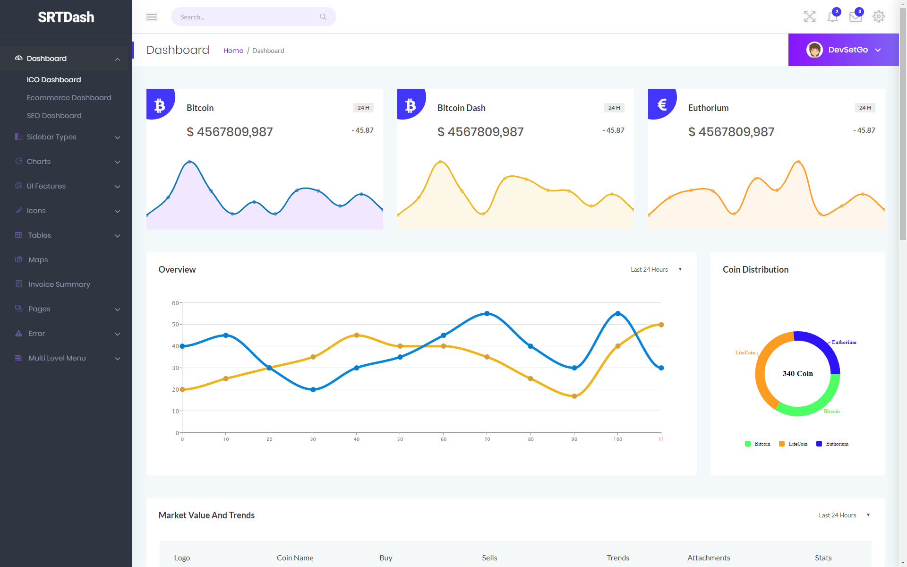
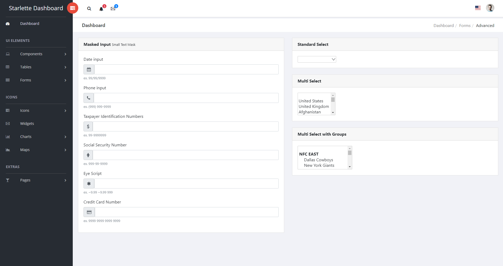
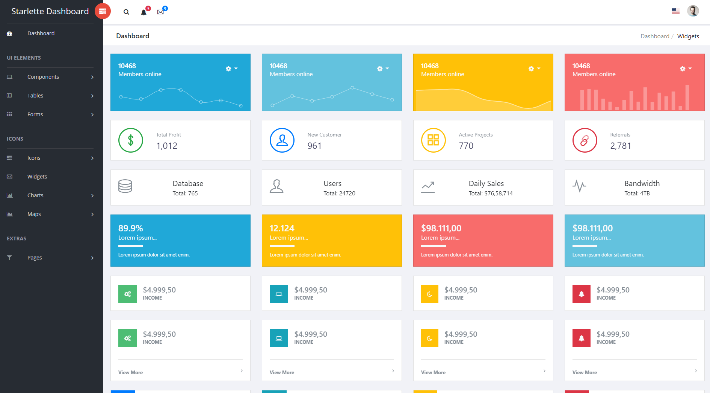

Python:

<a href="https://github.com/psf/black">

CI/CD Pipeline:

SonarCloud:

# Starlette - Dashboard Template (pre-release)

Note: The AdminLTE 3.0 template has thousands of issues according to SonarCloud. All are due to template issues and issues within JavaScript for UI dependencies. Working on determining a way to solve these issues or frankly just ignore them.

Utilizing [Starlette](https://www.starlette.io/) to render the [AdminLTE 3.0](https://adminlte.io/) template. This is a basic example to be used as the base/skeleton/template for Starlette applciations.

### Use it
- git clone https://github.com/devsetgo/starlette-dashboard
- create a virtualenv on linux or Windows Subsystem Linux

#### Run APP
First Change directory to 'app'

Update .env file with your settings
~~~~
cp .env_sample .env
~~~~
Or use [docker image](https://hub.docker.com/repository/docker/mikeryan56/starlette-dashboard/tags?page=1)
~~~~
docker run mikeryan56/starlette-dashboard:latest
~~~~

UVICORN
    Run Development (pick one):
~~~~
    uvicorn main:app --port 5000 --reload
    python3 main.py
    ./scripts/dev_run.sh
~~~~
    Run Production (pick one):
~~~~
    uvicorn main:app --workers 2 --port 5000
    gunicorn -c gunicorn_cfg.py main:app
    # Note: gunicorn is the config for the dockerfile
    ./script/prd_run.sh
~~~~

Docker
~~~~
    Docker: docker pull mikeryan56/starlette-dashboard:latest (not implemented)
~~~~

#### Run Tests
~~~~
python3 -m pytest
./scripts/tests.sh
~~~~

#### Create coverage badge
not needed if tests run from ./scripts/tests.sh
~~~~
    coverage-badge -o coverage.svg -f
~~~~

#### Pre-Commit & Hooks
Not needed if ./scripts/tests.sh is run. It will install and update.
~~~~
    - Follow install instructionsL: [https://pre-commit.com/#install](https://pre-commit.com/#install)
    - pre-commit install
    - pre-commit run -a
~~~~

## Issues/Bugs

- [ ] cleanup

## TODO

- [x] Create tests
    - [x] Minimum of 80% (Goal to maintain - can drop during build cycles)
    - [x] Exception Testing
    - [ ] Mock [requests](https://2.python-requests.org/en/master/) call
- [x] Better organization
    - [x] Use of Endpoints (equivalent to Flask Blueprints) - starlette routes and endpoint (/app/routes)
- [x] Configuration Scripts

- [x] Access Controls
  - [x] OAuth via GitHub
  - [x] Mock GITHub Oath
  - [x] Require Authentication on specified routes
  - [x] Profile Page to see you repos and other Github data (limited to 100 items)

- [x] Gunicorn/Uvicorn configuration
- [x] Logging (using [Loguru](https://github.com/Delgan/loguru))
- [x] Setup CI/CD Pipeline for test and deployment
    - [x] [SonarCloud](https://sonarcloud.io)
    - [x] [Github Actions](https://github.com/features/actions) found in .github/workflow/actions
        - [x] tests - matrix run of Python 3.6 and 3.7
            - [x] CodeCove.io upload
        - [x] docker-rc - docker build and push when pull request approved for release-candidate branch (calendar version - rc)
        - [x] docker-master - docker build and push when pull request approved for master branch (calender version and latest)
        - [x] ensure docker build only happens after pull_request approved and merged into higher branch
- [x] [Twelve Factor App](https://12factor.net/) ready
- [ ] Build a [cookiecutter](https://github.com/audreyr/cookiecutter) template for
- [ ] Add code comments
- [ ] Websocket example

- Docker
  - [x] Docker Image
  - [x] Docker-Compose
    - [ ] Docker Swarm settings
  - [ ] Kubernetes Kompose

- Tutorials/Documentation
  - [ ] Basic Overview
  - [ ] Explantion of Functions
  - [ ] Explantion of Configuration

### Screenshots

